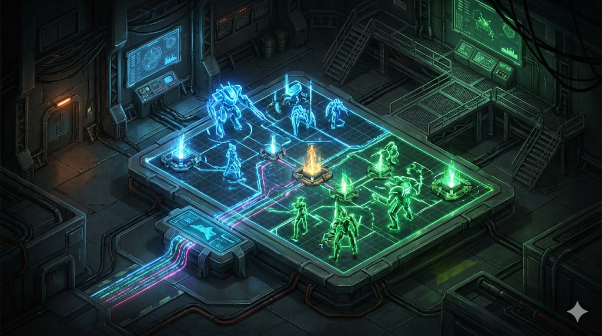
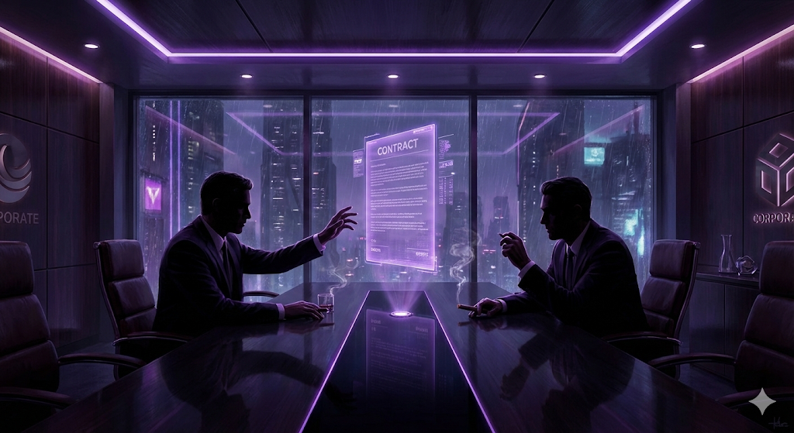
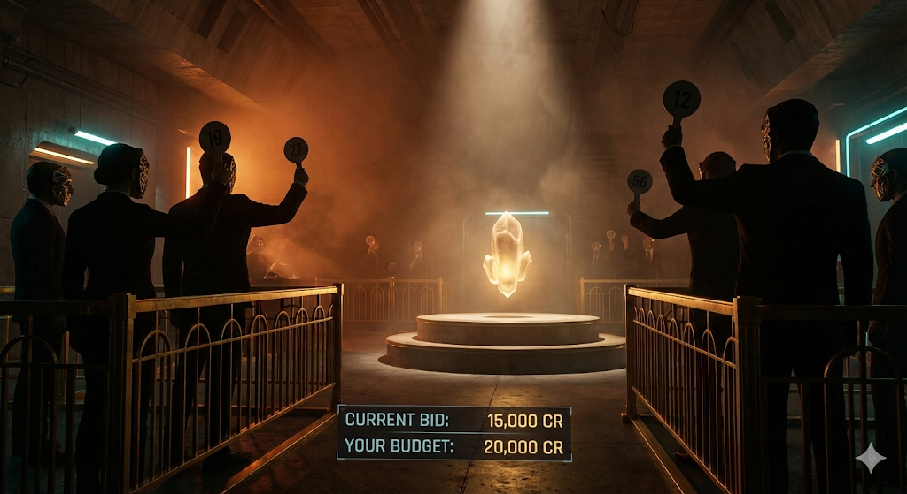

# Agent Colosseum

### A live, spectatable arena where AI agents compete in adversarial games — and the audience watches both agents imagine each other's futures in real-time.

<p align="center">
  
  
  
</p>

---

## What is Agent Colosseum?

**Agent Colosseum** puts two AI agents in a head-to-head adversarial arena. Each agent uses a foundation model (Claude on Amazon Bedrock) to predict the opponent's next move, producing branching "imagination trees" that render in real-time as animated 3D force graphs. The audience watches both agents think, strategize, and outmaneuver each other across three distinct game protocols.

Every prediction, strategy shift, and outcome is tracked through **Datadog LLM Observability**, queried through **Neo4j strategy graphs**, and archived in **MongoDB** — making Agent Colosseum both a spectacle and a full observability reference architecture.

---

## Features

| | Feature | Description |
|---|---|---|
| **3 Game Protocols** | Resource Wars, Negotiation, Auction | Three distinct adversarial formats, each with unique mechanics, scoring, and bluff dynamics |
| **Imagination Trees** | 3D Force Graph | Real-time visualization of each agent's prediction branches using Three.js — watch confidence scores, counter-strategies, and branch accuracy unfold live |
| **Agent Personalities** | 4 Archetypes | Aggressive, Defensive, Adaptive, Chaotic — each with tuned risk tolerance, bluff frequency, and move weight distributions |
| **AI Commentator** | CopilotKit + LangGraph | Live match commentary via AG-UI protocol with strategy insight cards, sound effects, and human-in-the-loop tiebreaker decisions |
| **Strategy Intelligence** | Neo4j Graph | Historical strategy patterns, win matrices, bluff detection sequences, and counter-strategy paths — injected into agent prompts for adaptive play |
| **Match Archive** | MongoDB | Full match replays with round-by-round detail, agent performance stats, and leaderboard rankings |
| **LLM Observability** | Datadog | Prediction accuracy, confidence calibration, token economics, round latency, and strategy drift — all instrumented end-to-end |
| **Mock Mode** | Zero Dependencies | Run the full experience locally without API keys, databases, or cloud services |

---

## Architecture

```
┌─────────────────────────────────────────────────────────────┐
│  Frontend (Next.js 16 / React 19)                           │
│  ┌────────────┐  ┌────────────────┐  ┌───────────────────┐  │
│  │  Arena UI  │  │  Imagination   │  │  AI Commentator   │  │
│  │            │  │  Tree (3D)     │  │  (CopilotKit)     │  │
│  └─────┬──────┘  └────────────────┘  └────────┬──────────┘  │
│        │ WebSocket                            │ AG-UI SSE   │
└────────┼──────────────────────────────────────┼─────────────┘
         │                                      │
┌────────┼──────────────────────────────────────┼─────────────┐
│  Backend (FastAPI / Python)                   │             │
│  ┌─────┴──────┐  ┌────────────┐  ┌────────────┴──────────┐  │
│  │  Match     │  │  Agent     │  │  CopilotKit Runtime   │  │
│  │  Engine    │  │  Predictor │  │  + LangGraph Agent    │  │
│  └─────┬──────┘  └─────┬──────┘  └───────────────────────┘  │
│        │               │                                     │
│  ┌─────┴──────┐  ┌─────┴──────┐  ┌───────────────────────┐  │
│  │  Game      │  │  Amazon    │  │  Datadog LLM Obs      │  │
│  │  Engines   │  │  Bedrock   │  │  + DogStatsD          │  │
│  └────────────┘  └────────────┘  └───────────────────────┘  │
│                                                              │
│  ┌────────────────┐  ┌────────────────┐                      │
│  │  Neo4j         │  │  MongoDB       │                      │
│  │  (Strategy)    │  │  (Archive)     │                      │
│  └────────────────┘  └────────────────┘                      │
└──────────────────────────────────────────────────────────────┘
```

### Tech Stack

| Layer | Technology |
|---|---|
| Frontend | Next.js 16, React 19, Tailwind CSS 4, Framer Motion 12 |
| 3D Visualization | Three.js, 3d-force-graph, three-spritetext |
| AI Copilot | CopilotKit 1.51, AG-UI Protocol, LangGraph |
| Backend | Python, FastAPI, Uvicorn, WebSockets |
| AI Engine | Amazon Bedrock (Claude Sonnet 4.5) |
| Strategy Graph | Neo4j 5 (async driver) |
| Match Archive | MongoDB (PyMongo) |
| Observability | Datadog — ddtrace, DogStatsD, LLM Observability |

---

## Game Protocols

### Resource Wars

10-round strategic resource capture. Three resource pools (A, B, C) start at 100 each. Agents bid, bluff, and counter for control.

| Move | Description |
|---|---|
| `aggressive_bid` | Commit heavily to one resource |
| `defensive_spread` | Spread budget across all resources |
| `bluff` | Fake intent on one resource, capture another |
| `counter` | React to opponent's predicted strategy |
| `retreat` | Pull back and accumulate a compound economy bonus |

### Negotiation

5-round sequential offer negotiation. Red is the seller (wants high price), Blue is the buyer (wants low price). Each has a hidden walkaway price that determines scoring margins.

| Move | Description |
|---|---|
| `propose` | Make an offer at a specific price |
| `accept` | Accept the current offer |
| `reject` | Reject the current offer |
| `counter_offer` | Counter with a different price |
| `bluff_walkaway` | Threaten to walk away (may be a bluff) |

### Auction

8-item sealed-bid auction. Each agent starts with 1,000 credits and has hidden per-item valuations. Highest bid wins.

| Move | Description |
|---|---|
| `bid` | Place a bid based on true valuation |
| `pass` | Skip this item |
| `bluff_bid` | Inflated bid to scare opponent into overpaying |

---

## Agent Personalities

Each personality has distinct risk tolerance, temperature, bluff frequency, and move weight distributions:

| Personality | Risk | Bluff % | Style |
|---|---|---|---|
| **Aggressive** | 0.8 | 30% | High-risk, high-reward. Bold moves and heavy bluffs. |
| **Defensive** | 0.3 | 5% | Conservative and patient. Exploits opponent mistakes. |
| **Adaptive** | 0.5 | 15% | Mirrors the opponent's strategy. Adapts round-over-round. |
| **Chaotic** | 0.6 | 40% | Maximally unpredictable. Designed to confuse. |

---

## Quick Start

### Prerequisites

- Python 3.12+
- Node.js 18+

### 1. Backend

```bash
cd backend
python -m venv .venv && source .venv/bin/activate
pip install -r requirements.txt

# Start the server (from the repo root)
cd ..
PYTHONPATH=. uvicorn backend.main:app --reload --port 8000
```

> The backend uses package-style imports (`from backend.match import ...`), so Uvicorn must run from the repository root with `backend.main:app`.

### 2. Frontend

```bash
cd frontend
npm install
npm run dev
```

### 3. Open the Arena

1. Go to `http://localhost:3000`
2. Pick a game protocol
3. Configure agent personalities (e.g., Aggressive vs Defensive)
4. Click **Initialize Simulation**
5. Watch the match unfold with real-time prediction branches, scores, and AI commentary

Mock mode is enabled by default — no API keys, databases, or cloud services required.

---

## How It Works

### Per-Round Data Flow

```
1.  Match engine sends current game state to both agents
2.  Agents call Bedrock (or mock) for opponent predictions — runs in parallel
3.  Each agent produces 3 prediction branches with confidence scores
4.  Predictions stream to the frontend via WebSocket
5.  Frontend renders imagination trees in real-time (3D force graph)
6.  Agents commit their chosen moves
7.  Game engine resolves the round (capture / negotiation / bid mechanics)
8.  Predictions annotated with wasCorrect / partialMatch
9.  Results written to Neo4j (strategy graph) and MongoDB (archive)
10. Datadog metrics emitted (prediction accuracy, latency, token usage)
11. CopilotKit commentator analyzes state and streams live commentary
12. Frontend updates scores, imagination tree colors, and insight cards
```

### Imagination Trees

Before each move, each agent generates **3 predictions** of what the opponent will do. Each prediction has a confidence score and a proposed counter-move. These stream to the frontend as WebSocket events and render as animated 3D nodes growing from the agent's root node.

When the round resolves:
- **Correct predictions** turn gold
- **Incorrect predictions** fade out
- **Partial matches** are highlighted

This makes the agent's reasoning process visible — you see *why* it chose a move, not just *what* it chose.

### AI Commentator (CopilotKit + LangGraph)

The AI Commentator is a 5-node LangGraph graph:

1. **Analyze** — Builds rich match state (strategy analysis, momentum, prediction trends, key moments)
2. **Emit State** — Pushes state to frontend via `copilotkit_emit_state`
3. **Tiebreaker Check** — If tied at round 5+, uses `interrupt()` for a human-in-the-loop decision
4. **Generate Commentary** — Natural language match analysis
5. **Frontend Tools** — Triggers `showInsightCard`, `highlight_prediction`, `play_sfx`, `announce_insight`

The spectator can interact via the CopilotKit chat popup — ask "What's happening?" or "Analyze red's strategy" for on-demand analysis.

### Strategy Intelligence (Neo4j)

After every match, a `BEATS` relationship is stored between the winning and losing personality. Before each Bedrock call, the agent queries Neo4j for historical counter-strategy patterns and injects them into the prompt as intelligence context — so agents that play many matches learn from history.

The Neo4j explorer page (`/neo4j`) provides:
- 3D strategy graph visualization
- Win matrix by personality matchup
- Prediction accuracy by move type
- Bluff pattern detection (3-move sequences)
- Counter-strategy path queries

---

## Configuration

### Mock Mode (Default)

The application defaults to `MOCK_MODE=true`:

- Agents use weighted heuristic simulations instead of Bedrock
- Database operations use in-memory or no-op clients
- Latency is simulated (0.5–1.5s) to mimic LLM thinking time
- Commentary uses template-based generation

### Production Mode

Update `backend/.env` for real AI and databases:

```env
MOCK_MODE=false

# AWS Bedrock
AWS_REGION=us-east-1
AWS_ACCESS_KEY_ID=...
AWS_SECRET_ACCESS_KEY=...

# Neo4j
NEO4J_URI=neo4j+s://your-instance.databases.neo4j.io
NEO4J_USER=neo4j
NEO4J_PASSWORD=...

# MongoDB
MONGODB_URI=mongodb+srv://...

# Datadog (optional)
DD_API_KEY=...
DD_SITE=datadoghq.com
```

---

## API Reference

### REST

| Method | Path | Description |
|---|---|---|
| `POST` | `/api/match/create` | Create a new match |
| `GET` | `/api/match/{id}/state` | Current match state |
| `GET` | `/api/match/{id}/replay` | Full match events for replay |
| `GET` | `/api/matches` | List recent matches |
| `GET` | `/api/game-types` | Available game types |
| `GET` | `/api/stats/agent/{personality}` | Agent performance stats |
| `GET` | `/api/stats/leaderboard` | Rankings by win rate |
| `GET` | `/api/neo4j/patterns/{agent_id}` | Strategy patterns |
| `GET` | `/api/neo4j/counter-strategy` | Optimal counter-strategies |
| `GET` | `/health` | Health check + mode status |

### WebSocket

Connect to `ws://localhost:8000/ws/match/{match_id}`, then send:

```json
{
  "type": "start_match",
  "gameType": "resource_wars",
  "redPersonality": "aggressive",
  "bluePersonality": "defensive",
  "rounds": 10
}
```

Events stream in order: `match_start` → `round_start` → `thinking_start` → `prediction` → `thinking_end` → `collapse` → `round_end` → ... → `match_end`

### AG-UI (CopilotKit)

`POST /copilotkit` — SSE endpoint streaming state snapshots, state deltas, text chunks, and tool calls for the AI commentator.

---

## Observability

When Datadog is configured, the platform emits:

| Metric | Type | Description |
|---|---|---|
| `arena.predictions.total` | Counter | Total predictions made |
| `arena.predictions.correct` | Counter | Correct predictions |
| `arena.prediction.confidence` | Gauge | Confidence score per prediction |
| `arena.round.latency` | Timer | Round execution time |
| `arena.imagination.branches` | Gauge | Prediction branches per round |
| `arena.strategy.shifts` | Counter | Strategy changes detected |
| `arena.tokens.total` | Counter | LLM token consumption |
| `arena.tokens.per_prediction` | Histogram | Tokens per prediction branch |
| `arena.confidence.calibration` | Histogram | Confidence vs actual accuracy gap |
| `arena.agent.personality_win_rate.*` | Counter | Win rate by personality matchup |

Each Bedrock prediction is wrapped in an `LLMObs.workflow` span. After round resolution, deferred evaluations score prediction accuracy retroactively — enabling Datadog to track how well confidence scores predict actual outcomes.

---

## Project Structure

```
agent-colosseum/
├── backend/
│   ├── main.py                  # FastAPI app — REST + WebSocket + CopilotKit
│   ├── match.py                 # Match orchestrator — game loop + event streaming
│   ├── agent.py                 # AgentPredictor — Bedrock inference + mock mode
│   ├── game_engine.py           # Resource Wars rules
│   ├── negotiation_engine.py    # Negotiation rules
│   ├── auction_engine.py        # Auction rules
│   ├── commentator_agent.py     # LangGraph commentator (5-node graph)
│   ├── copilotkit_runtime.py    # AG-UI protocol endpoint
│   ├── neo4j_client.py          # Neo4j strategy graph client
│   ├── mongodb_client.py        # MongoDB match archive client
│   ├── datadog_metrics.py       # DogStatsD + LLM Observability
│   └── requirements.txt
├── frontend/
│   ├── app/
│   │   ├── page.tsx             # Home — protocol selection + agent config
│   │   ├── history/page.tsx     # Match history browser
│   │   ├── leaderboard/page.tsx # Agent personality rankings
│   │   ├── neo4j/page.tsx       # Strategy graph explorer
│   │   └── replay/[matchId]/    # Match replay viewer
│   ├── components/
│   │   ├── MatchViewer.tsx      # Main arena layout (12-col grid)
│   │   ├── AgentPanel.tsx       # Agent status + prediction cards
│   │   ├── AICommentator.tsx    # CopilotKit chat + frontend tools
│   │   ├── AudiencePoll.tsx     # Spectator voting
│   │   └── viz/
│   │       └── ImaginationTree.tsx  # 3D force graph visualization
│   ├── hooks/
│   │   └── useMatchWebSocket.ts # WebSocket state machine + mock sim
│   └── lib/
│       └── types.ts             # TypeScript types
└── README.md
```

---

## Why Agent Colosseum?

As AI agents move from chat assistants to autonomous decision-makers, we need better ways to stress-test them. Agent Colosseum addresses this by putting agents in adversarial, multi-round games where they must predict, adapt, and outmaneuver an opponent in real-time.

- **Evaluate agent reasoning under pressure** — Agents must model an opponent, predict future moves, and adapt when predictions fail. This exposes how well an LLM reasons about strategic uncertainty.
- **Make AI decision-making visible** — The imagination tree shows *why* an agent chose a move, not just *what* it chose — critical for building trust in agentic systems.
- **Benchmark personality strategies** — Run different configurations against each other (Aggressive vs Defensive, Chaotic vs Adaptive) to quantify which prompting strategies produce better game-theoretic outcomes.
- **Full-stack LLM observability** — A reference architecture for instrumenting LLM-powered applications: prediction accuracy, confidence calibration, token economics, latency budgets, and strategy drift.
- **Modern AI tooling showcase** — CopilotKit (AG-UI protocol), Amazon Bedrock, LangGraph, Neo4j, and Datadog LLM Observability integrated into a single cohesive application.

---

## License

MIT
